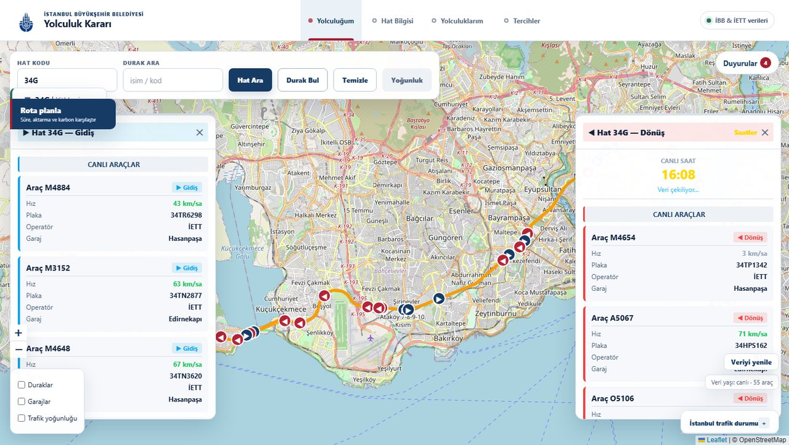
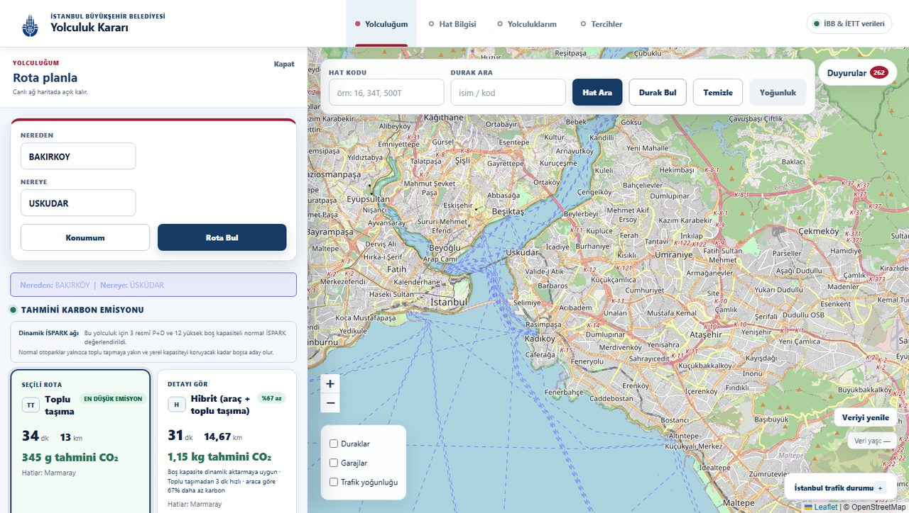
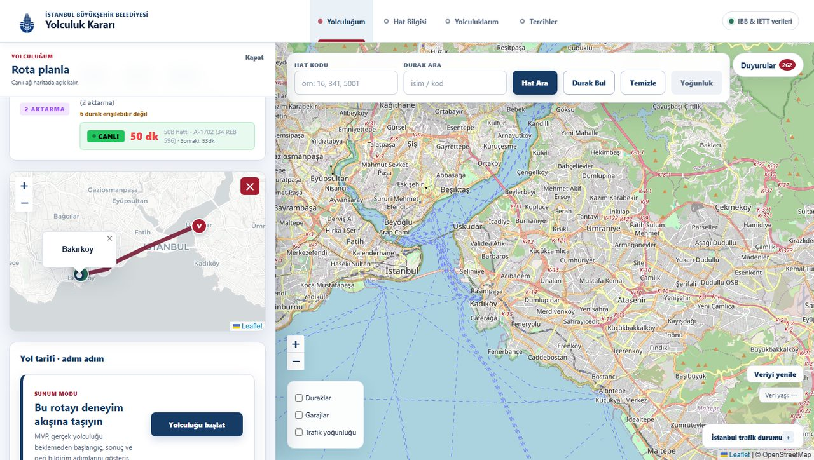
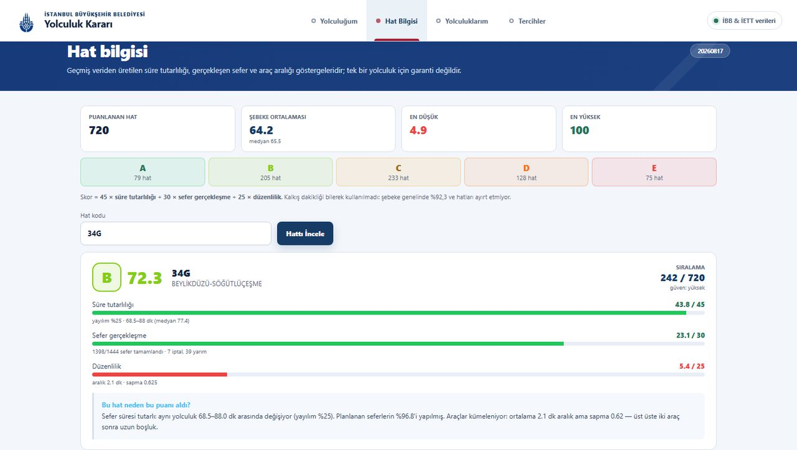
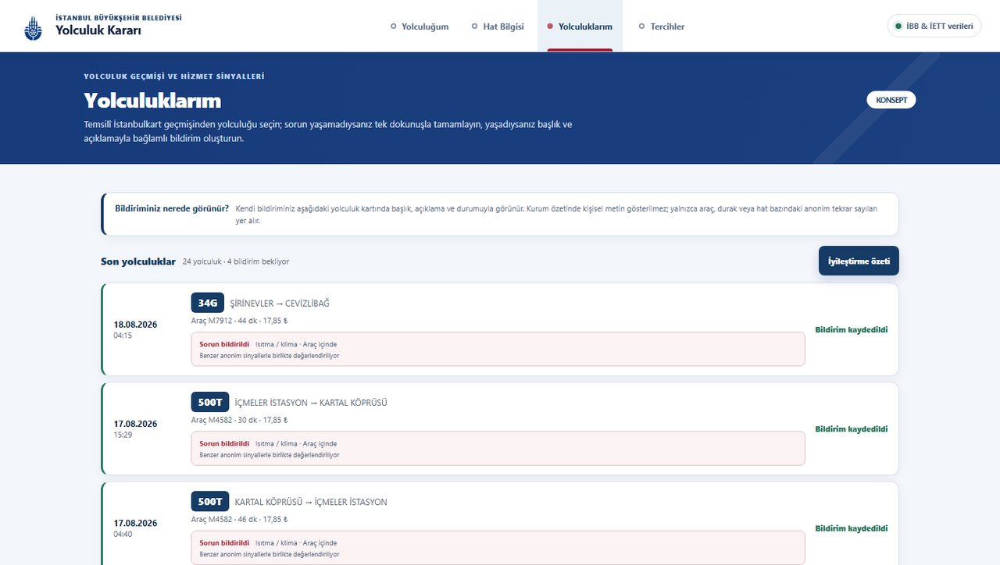

# İBB Yolculuk Kararı

Canlı yolculuk kararını, erişilebilirlik ve geri bildirim sinyallerini
kurumun iyileştirme süreciyle buluşturan İBB ulaşım konsepti.

Tech İstanbul İnovasyon Yaz Kampı · sunum **1 Ağustos 2026**

`Desktop/iett staj/iett_panel` klasörünün kopyasından türetildi.
**Orijinale dokunulmadı.**

---

## Kurulum

```bash
pip install -r requirements.txt
```

`.env.example` dosyasını `.env` olarak kopyalayıp doldurun:

```
IETT_USER=<kullanıcı adı>
IETT_PASS=<parola>
TOMTOM_KEY=          # opsiyonel — boşsa İBB TrafficIndex kullanılır
```

Kimlik bilgileri koda gömülü değildir; `.env` `.gitignore`'dadır. Boş
bırakılırsa uygulama yine çalışır, yalnızca kimlik isteyen servisler
(canlı otobüs GPS'i, duyurular) veri döndürmez.

```bash
python app.py
```

→ **http://localhost:5001** (5000 portu staj panelinde, ikisi aynı anda
çalışabilsin diye ayrıldı)

---

## Sayfalar

| Sekme | İçerik |
|---|---|
| **Yolculuğum** | Sağda sürekli açık canlı harita; soldan açılan rota panelinde bütün modların süre/karbon karşılaştırması, resmî P+D ve boş kapasiteli normal İSPARK'lardan oluşan dinamik aktarma ağı, temsilî İstanbulkart teşviki ve sunum modu yolculuk sonucu |
| **Hat Bilgisi** | Geçmiş veriden süre tutarlılığı, gerçekleşen sefer, düzenlilik ve açıklaması |
| **Yolculuklarım** | Temsilî İstanbulkart geçmişi; aktarmalı rotada sorun yaşanan aracı seçme, yıldızsız sorun başlığı + açıklama, yolcunun kendi bildirim durumu ve araç/durak/hat bazında anonim tekrarlar *(konsept)* |
| **Tercihler** | Kart türünden bağımsız erişilebilirlik bilgisi ve düşük emisyon önceliği *(konsept)* |

---

## Ekrandan

### Canlı harita — hat aramak

`34G` yazıp **Hat Ara**'ya basınca hattın güzergâhı çizilir ve o an yolda olan
araçlar yön oklarıyla haritaya düşer. Sağdaki panel her aracın hızını, plakasını
ve bağlı olduğu garajı gösterir; **gidiş ve dönüş ayrı listelenir**. Sağ alttaki
rozet verinin yaşını dürüstçe yazar (`canlı · 55 araç`); servis yanıt vermezse
"12 dk önceki veri" der, canlı gibi göstermez.



### Rota planlamak — süre ve karbon birlikte

**Rota planla** panelinden nereden/nereye girilir. Sonuç yalnızca süre değil:
her mod için tahmini CO₂ da hesaplanır ve en temiz seçenek işaretlenir.
Aşağıdaki örnekte Bakırköy → Üsküdar için toplu taşıma **34 dk / 345 g**,
hibrit (araç + toplu taşıma) **31 dk / 1,15 kg** çıkıyor — hibrit 3 dakika
hızlı ama karbonu 3 kat fazla, ve bu açıkça yazılıyor.



### Adım adım yol tarifi

Bir mod seçilince panel yürüme, bekleme ve seyahat sürelerini ayrıştırır,
güzergâhı kendi haritasına çizer. Canlı araç varsa **CANLI** rozetiyle kaç
dakikaya geleceğini, yoksa **PLAN** rozetiyle planlı sefer saatini gösterir —
ikisi hiçbir zaman karıştırılmaz.



### Hat karnesi

Her hat, geçmiş sefer arşivinden 100 üzerinden puanlanır. Puanın nereden
geldiği gizlenmez: üç bileşenin kırılımı, ham değerler ve düz Türkçe bir
gerekçe gösterilir. Aşağıda 34G metrobüs süre tutarlılığında 43,8/45 alıyor
ama düzenlilikte 5,4/25 — araçlar kümeleniyor, sistem bunu yakalıyor.



### Yolculuklarım *(konsept)*

Temsilî İstanbulkart geçmişinden yolculuk seçilir; sorun yaşanmadıysa tek
dokunuşla tamamlanır, yaşandıysa konum + başlık + açıklamayla bildirilir.
Kurum görünümünde aynı araç/durak/hat için gelen bildirimler anonim olarak
gruplanır. ⚠️ Gerçek İstanbulkart entegrasyonu **yok**, veriler temsilîdir.



---

## Öne çıkan dört şey

**1. Güvenilirlik skoru gerçekten ayırt ediyor.**

```
Skor = 45 × süre_tutarlılığı + 30 × sefer_gerçekleşme + 25 × düzenlilik
```

Plan dökümanındaki ilk formül "dakiklik + iptal" idi. Ölçtük: kalkış
dakikliği şebeke genelinde yüksek ve hatlar birbirinden yeterince
ayrışmıyor — o formül herkese benzer puan verirdi. Son yüklenen arşivde
**732 hat** puanlandı; ortalama **64,3**, medyan **66,1**, aralık
**0–100**. Harf dağılımı A=79 · B=212 · C=233 · D=135 · E=73.

**2. Tahmin açıklanabilir.** Rota panelinde yürüyüş, bekleme, seyahat ve
trafik gecikmesi ayrı ayrı; hat karnesinde gerekçe sayılara dayalı.
Örnek: *129T — 50,6 puan (D), 578/732. Süre yayılımı %60; 39 planlı
seferin 37'si tamamlandı, araç aralığı sapması 0,62.*

**3. Karbon hesabı kaynaklı.** Otobüs emisyonu İETT'nin kendi yakıt
verisinden (356.979 L ÷ 1.042.413 araç-km = 918 gCO₂/araç-km), araç tipine
göre solo/körüklü ayrıştırıldı; filo kompozisyonuyla harmanlandığında
ölçülen değeri **%0,16** farkla yeniden üretiyor.

**4. Geri bildirim ölçülebilir sinyale dönüşüyor.** Yolcunun zaten yaptığı
yolculuk veri kaynağı olur: tek dokunuşla kapanır, sorun varsa yapılandırılmış
gelir, aynı araç için 3 ayrı sinyal birikince kurum tarafında **inceleme adayı**
üretir. Ayrıntısı aşağıda.

---

## Geri bildirim döngüsü — projenin asıl amacı

Uygulamanın çıkış noktası "güzel bir rota bulucu" değildi. Toplu taşımadaki
eksiklikler kurum tarafında **görünmüyor**: bir otobüsün kliması iki haftadır
bozuksa bunu yalnızca o hatta binen yolcu bilir, sistemde hiçbir iz bırakmaz.
Şikâyet hatları ise tekil, doğrulanamaz ve önceliklendirilemez.

Bu proje o boşluğu kapatmayı deniyor: **yolcunun zaten yaptığı yolculuğu
veri kaynağına çevirmek.**

### Nasıl işliyor

**1 · Yolculuk kendiliğinden düşer.** Kart geçmişinden yolculuk profile
gelir; yolcunun ayrıca "şunu kullandım" demesine gerek yok. Bariyer ne kadar
düşükse geri bildirim o kadar çok gelir.

**2 · Tek dokunuşla kapanır.** Sorun yaşanmadıysa yolcu tek düğmeye basar.
Geri bildirimin çoğu "sorun yok"tur ve bu da veridir — yalnızca şikâyet
toplayan sistem, hattın ne zaman iyi çalıştığını asla öğrenemez.

**3 · Sorun varsa yapılandırılmış gelir.** Serbest metin değil: önce **nerede**
(araç içinde / durakta / hat genelinde), sonra **ne** (ısıtma-klima, temizlik,
yoğunluk, erişilebilirlik, bekleme süresi, ekipman arızası…), sonra kısa
açıklama. Böylece bildirim gruplanabilir hâle gelir.

**4 · Aynı sinyal tekrarlanınca inceleme adayı olur.** Tek şikâyet gürültü
olabilir; aynı araç için **3 ayrı yolcudan aynı konu** gelirse bu artık
desendir. Eşik `TEKRAR_ESIGI = 3` (`profil.py:18`).

**5 · Kurum tarafına anonim düşer.** Kişisel metin gösterilmez; yalnızca
araç/durak/hat bazında sayılan tekrarlar.

### Kurum görünümü — gerçek çıktı

`/api/profil/kurum_rapor` ucunun temsilî veriyle ürettiği rapor:

```
tamamlanan yolculuk : 20        sorunlu : 4        sorun oranı : %20
─────────────────────────────────────────────────────────────────────
GRUPLANAN SİNYAL
  araç M7912 · Isıtma / klima · 3 bildirim   → İNCELEME ADAYI

ÜRETİLEN İŞ MADDESİ
  "M7912 için araç inceleme adayı"
  Isıtma / klima — 3 bildirim; saha doğrulaması gerekir
```

Dikkat edin: çıktı **iş emri değil, aday**. Sistem "bu aracı tamir et" demiyor,
"burada tekrarlayan bir sinyal var, saha doğrulaması gerekiyor" diyor. Kararı
kurum verir.

### Erişilebilirlik ayağı

Şebekedeki durakların yalnızca **%5,6'sı** erişilebilir ve ilçeler arası fark
30 kattan fazla. Engelli kart tipindeki kullanıcılardan aynı durak için gelen
sinyaller ayrıca işaretlenir — böylece "hangi durak önce yenilenmeli" sorusu
tahminle değil, o durağı gerçekten kullanamayan insanların sayısıyla yanıtlanır.

### Ödül ve kötüye kullanım

Geçerli değerlendirme sayısı ödüle bağlanabilir (konseptte 10 değerlendirme =
1 ücretsiz biniş). Bu, ödül avcılığını davet ettiği için bir **geçerlilik
kontrolü** var: soruların en az yarısı yanıtlanmalı, hepsine aynı puan
verilmişse ayrım yok sayılır, düşük puana kısa da olsa gerekçe beklenir.
Reddedilen geri bildirim **yine kaydedilir** — yalnızca ödül sayacına girmez.
Amaç yorumu sansürlemek değil, sayacı korumak.

> ⚠️ **Bu katman konsepttir.** Gerçek İstanbulkart entegrasyonu yok, veriler
> temsilîdir. Amaç ürün mantığının çalışır hâlini göstermek; kişisel veri
> toplanmıyor, hiçbir yere gönderilmiyor.

Arayüzdeki hâli için yukarıdaki [Yolculuklarım](#yolculuklarım-konsept)
ekran görüntüsüne bakın.

---

## Dosya haritası

| Dosya | İçerik |
|---|---|
| `app.py` | Giriş noktası, `.env` yükler |
| `services.py` | SOAP istemcisi, cache, ETA motoru, arka plan iş parçacıkları |
| `routes.py` | Canlı uçlar |
| `skor.py` | Güvenilirlik skoru + hat karnesi |
| `profil.py` | Tercihler / yolculuk geri bildirimi *(konsept, mock veri)* |
| `rayli.py` | İBB GTFS verisinden planlı raylı sistem rota motoru |
| `templates/index.html` | Tüm arayüz |
| `data/rayli_ag.json` | 23 raylı sistem servis kaydının istasyon ağı |
| `scripts/build_rayli_ag.py` | İBB Açık Veri GTFS paketinden raylı ağı yeniler |
| `data/hat_profil.json` | 735 hat için kalibre süre profili |
| `hat_durak_sira.json` | 837 hat için YÖN + SIRANO durak sırası |
| `panel_data/` | 841 güzergâh çizgisi, hat listesi, kapasite, araç bakım kaydı |

Teknik ayrıntı ve her düzeltmenin **gerekçesi** için `MUHENDISLIK_NOTLARI.md`,
güncel ürün kararları için `docs/URUN_MANTIGI.md`.

---

## Veri kaynakları

| Servis | Kimlik | Ne veriyor |
|---|---|---|
| `FiloDurum/SeferGerceklesme.asmx` | gerekli | Canlı otobüs GPS konumu ⚠️ **saatte 100 istek** |
| `UlasimAnaVeri/HatDurakGuzergah.asmx` | gerekli | Hat uzunluğu, sefer süresi, **duraklar + YÖN + SIRANO** |
| `ibb/ibb360.asmx` → `GetIettArsivGorev_json` | gerekmez | Planlanan vs gerçekleşen sefer — ~44.000 kayıt/gün |
| `UlasimAnaVeri/PlanlananSeferSaati.asmx` | gerekmez | Planlanan sefer saatleri |
| `UlasimDinamikVeri/Duyurular.asmx` | gerekli | Sefer duyuruları |
| `tkmservices/.../TrafficIndex` | gerekmez | İBB trafik indeksi, 5 dk çözünürlük |
| `api.ibb.gov.tr/ispark/Park` | gerekmez | Yaklaşık 250 otopark, anlık boş kapasite ve P+D tesisleri |
| İBB Açık Veri · Toplu Ulaşım GTFS | gerekmez | Metro, Marmaray, tramvay, füniküler ve teleferik hat/istasyon/süre/sıklık verisi |
| OSRM public | gerekmez | Sürüş rotası (serbest akış) |

---

## Bilinen sınırlar

- **Raylı veri planlıdır.** Metro, Marmaray, T1/T3/T4, F1/F2/F3 ve TF1/TF2
  seçenekleri GTFS istasyon sırası ve sefer sıklığından hesaplanır; canlı araç
  konumu veya anlık aksama değildir. Açık veri yeni açılan uzatmaların gerisinde
  kalabilir. T5 bu pakette bulunmadığı için henüz yoktur; vapur ayrı bir
  saat-bağımlı rota motoru gerektirir.
- **Saatlik kota.** `FiloDurum` saatte 100 istekle sınırlı. Aşılınca canlı
  araç verisi kesilir ve yetki hatasıyla **aynı** mesajı verir. Ayırt etme:
  aynı anda başka servis çalışıyorsa sorun kotadır.
- **Yolculuk sonucu ve geri bildirim konsept.** Gerçek yolculuk takibi veya
  İstanbulkart entegrasyonu yoktur. “Yolculuk sonuna geç” bir sunum adımıdır;
  karbon farkı model tahminidir. Bildirimler otomatik iş emri değil, üç ve üzeri
  aynı anonim sinyalde kurum tarafından doğrulanacak aday üretir.
- **Isınma ~50 sn.** Araç yönü ardışık konumlardan da doğrulanıyor, bunun
  için 2 konum kaydı gerekiyor. Sunumdan 2 dakika önce başlatmak yeterli.

---

## Testler

```bash
pip install -r requirements-dev.txt
python -m pytest -q
```

56 test, birkaç saniye. **Canlı servise hiç çıkmazlar** — hepsi diskteki
veriyle çalışır, bir test ağa çıkmaya kalkarsa açıkça hata verir. Sebebi:
`FiloDurum` saatte 100 istekle sınırlı, testler kota harcasaydı
kullanılamaz olurlardı.

Ne korudukları: `tests/README.md`

---

## Doğrulama

| Test | Sonuç |
|---|---|
| Canlı uçlar (`python scripts/uc_denetimi.py`) | 43 uçtan **33 veri dönüyor · 10 boş · 0 hatalı**. Boş dönen 10'un 9'u arayüzden çağrılmıyor — arkalarındaki SOAP metotları erişime kapalı |
| Uç kullanımı | 45 uç tanımlı; arayüz **24'ünü** çağırıyor. Kalan 21'in dökümü aşağıda |
| Karbon iç tutarlılık | **72/72** kontrol |
| ETA doğruluğu (45.102 gerçek sefer) | medyan oran **0,998** · ±%20 içinde **%84** |
| Rota yön geçerliliği | ilk sıradaki rotalarda ters segment **0** |
| Güzergâh mesafesi | 1.399 çiftte geometri ihlali **0** |
| Hız makullüğü | 50 km/s üstü segment **0** |
| Regresyon testleri | **56/56** geçiyor, ağa hiç çıkmadan |
| Tarayıcı konsolu | temiz |

## Arayüzden çağrılmayan uçlar

`routes.py` **45** uç tanımlıyor, `templates/index.html` bunların **24'ünü**
çağırıyor. Kalan 21 uç şu üç gruba ayrılıyor — hiçbiri arayüzü etkilemiyor:

**A · Servis kapalı, kalıcı boş (9)** — staj panelinden miras. Arkalarındaki
SOAP metotları `Policy Falsified` / HTTP 500 döndürüyor, yani veri hiç gelmiyor:

`/api/rota_debug` · `/api/yolcu_analizi` · `/api/kara_kutu` ·
`/api/kara_kutu_sefer` · `/api/usulsuz_kart` · `/api/metrobus_hazir` ·
`/api/plaka_sorgula` · `/api/durak_sefer_saati` · `/api/yolcu_bilgilendirme`

**B · Çalışıyor, veri dönüyor, arayüze bağlanmamış (11)**

| Uç | Ne döndürüyor |
|---|---|
| `/api/ispark` | 252 otopark, anlık boş kapasite (~58 KB). Hibrit rota bu veriyi `/api/karbon_rota` yanıtı içinden alıyor, ucu ayrıca çağırmıyor |
| `/api/kavsaklar` | 2.585 kavşak (~397 KB) — haritaya hiç çizilmiyor |
| `/api/yogunluk` | Hat doluluğu. Karbon hesabı `hat_doluluk()` **fonksiyonunu** doğrudan kullanıyor, ucu değil |
| `/api/headway` · `/api/hat_bilgi` · `/api/arac_ozellik` | Hat/araç detayı — canlı veri dönüyor |
| `/api/trafik_nokta` · `/api/operasyonel_ozet` · `/api/plan_basari` | Küçük özet uçları |
| `/api/v1/dashboard` | Dış tüketiciler için toplu özet |
| `/api/tani` | Teşhis: önbellek boyutları ve örnek ham kayıt |

**C · Yazma ucu, arayüz başkasını kullanıyor (1)**

`/api/profil/degerlendir` — arayüz değerlendirmeyi `/api/profil/yolculuk_bildir`
üzerinden gönderiyor.

> Herkese açık bir sunucuya kurulursa `/api/tani` ve `/api/rota_debug` iç durum
> sızdırdığı için kapatılmalı; yerel demoda sorun değil.

## Lisans

Kaynak kod **MIT** — bkz. [LICENSE](LICENSE).

Veriler kapsam dışıdır: durak, hat, güzergâh, sefer arşivi ve GTFS verisi
**İBB / İETT'ye** aittir, kendi kullanım şartlarına tabidir. İETT ve İBB
isim ve logoları sahiplerine aittir; bu proje Tech İstanbul İnovasyon Yaz
Kampı kapsamında hazırlanmış **bağımsız bir öğrenci çalışmasıdır**, kurum
tarafından onaylanmış değildir.
